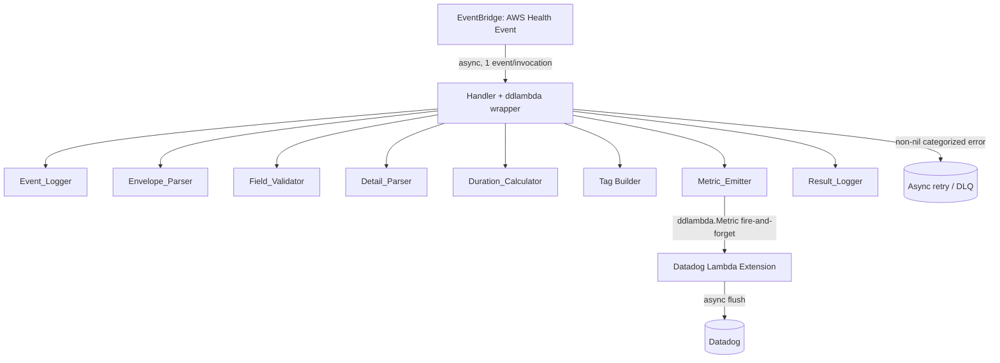
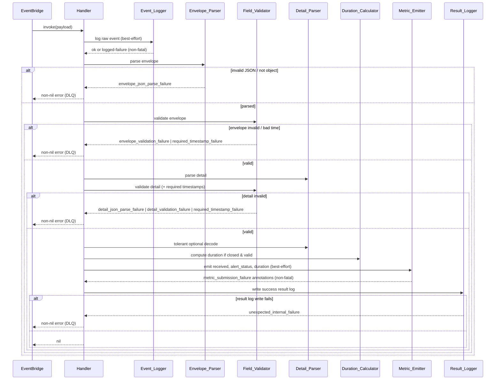

# Design Document

## Overview

The Health_Telemetry_Lambda is a Go AWS Lambda function invoked asynchronously by an Amazon EventBridge rule, one AWS Health event per invocation. Its sole responsibility is to process every received event and emit three custom Datadog metrics derived from that event. It performs no filtering, persistence, deduplication, or lifecycle correlation; all filtering is done by the EventBridge rule and all correlation/deduplication is done downstream.

Telemetry is submitted via the Datadog Lambda Go v2 library (`github.com/DataDog/dd-trace-go/contrib/aws/datadog-lambda-go/v2`, DDLambda_Library, known v2.9.1 — reconfirm at implementation time) using the global `ddlambda.Metric` helper and the `ddlambda` handler wrapper. There is no DogStatsD. All three metrics are fire-and-forget distributions buffered and flushed asynchronously by the Datadog Lambda Extension; the handler cannot observe delivery success or failure and only detects local submission errors (e.g., a runtime error or panic during the call).

Because Lambda application logs are not available in Datadog for compliance reasons, all dashboard-required dimensions and downstream correlation identifiers are carried in metric tags. The complete original event is preserved only in the initial raw-event log record, which is not sent to Datadog.

The design uses a two-tier error model:

- **Fail-closed** categorized non-nil handler errors for parse/validation/timestamp/unexpected-internal failures, so async retry and the DLQ can handle them.
- **Best-effort** `metric_submission_failure` log annotations for locally-detectable metric submission errors, which never fail the invocation.

Once validation passes, the handler returns `nil` regardless of metric submission outcomes. When multiple failures apply, the earliest-failed-step's category wins.

The three metrics:

| Metric | Value | Emitted when | Tags |
| --- | --- | --- | --- |
| `aws_health.issue.received` | `1` | Every validated event | 17-tag set |
| `aws_health.issue.alert_status` | `1` open / `0` closed\|upcoming | Every validated event (distribution-backed observed state) | 6 identity tags only |
| `aws_health.issue.duration_seconds` | whole seconds `endTime-startTime` | Closed event with valid start/end and `end>=start` | 17-tag set |

## Architecture

The Lambda is a single stateless Go binary. Processing is a linear pipeline with an early best-effort logging step and a terminal best-effort metric emission step. The top-level Handler orchestrates the pipeline and owns error categorization (earliest-failed-step wins).

Pipeline order:

1. Raw-event log first (best-effort; failure non-fatal per R1.6).
2. Parse envelope (`Envelope_Parser`).
3. Validate envelope (`Field_Validator`).
4. Parse detail (`Detail_Parser`).
5. Validate detail (`Field_Validator`).
6. Tolerant optional decode (optional detail fields).
7. Compute duration if applicable (`Duration_Calculator`).
8. Build tags.
9. Emit 3 metrics best-effort (`Metric_Emitter`).
10. Write success result log (`Result_Logger`); failure here IS fatal (`unexpected_internal_failure`).





## Components and Interfaces

- **Handler** (top-level, wrapped by `ddlambda.WrapFunction`/handler wrapper): orchestrates the pipeline, owns error categorization with earliest-failed-step-wins semantics, returns nil once validation passes regardless of metric outcome. Signature conceptually `func(ctx, json.RawMessage) error`.
- **Event_Logger**: writes the single-line initial raw-event JSON record before any parsing. Emits `{"record_type":"aws_health_event_received","event":{...}}` for valid JSON, or `{"record_type":"aws_health_event_received","raw_event":"...escaped..."}` for absent/null/empty/invalid JSON. No embedded newline/CR characters. Write failure is non-fatal (R1.6).
- **Envelope_Parser**: deserializes payload into the envelope struct exactly once, retaining `detail` as `json.RawMessage`, ignoring unknown top-level fields, preserving absent fields as absent. Non-object/invalid JSON → `envelope_json_parse_failure`.
- **Detail_Parser**: deserializes `detail` (`json.RawMessage`) into the detail struct; captures absent fields as unset; performs tolerant optional decode for `endTime`, `eventMetadata`, `affectedEntities`, `actionability`, `personas`. Non-object detail → `detail_json_parse_failure`.
- **Field_Validator**: validates required envelope fields and required detail fields (presence, type, non-blank strings, enum matches, account-id format, page/totalPages integers with `page<=totalPages`, non-empty `eventDescription`). Categorizes envelope failures as `envelope_validation_failure`, detail failures as `detail_validation_failure`, and timestamp-parse failures as `required_timestamp_failure`.
- **Duration_Calculator**: for closed events with parseable `startTime`/`endTime` and `end>=start`, computes non-negative whole-second duration; otherwise reports duration unavailable.
- **Metric_Emitter**: builds tags and makes exactly one best-effort `ddlambda.Metric` submission attempt per applicable metric per invocation. Received and alert_status always emitted for validated events; duration emitted only when computed. Local submission error → `metric_submission_failure` log annotation, never fatal.
- **Result_Logger**: writes exactly one single-line JSON success record with a `record_type` distinct from the raw-event record and containing the normalized tag values. Write failure → `unexpected_internal_failure` (fatal).

### Event Arn Tag Value derivation (shared by received, duration, alert_status)

1. Take substring after the first `event/` marker in detail `eventArn`.
2. If marker absent, use the full `eventArn`.
3. If the result exceeds 200 chars (post-normalization limit), truncate FROM THE END, retaining leading characters, to fit 200 chars (last resort).

## Data Models

Go structs use pointers/optionals so an absent field is distinguishable from an empty value. `detail` is held as `json.RawMessage` during envelope parse.

```go
// Envelope: outer EventBridge object. Unknown top-level fields ignored.
type Envelope struct {
    Version    *string         `json:"version"`
    ID         *string         `json:"id"`
    DetailType *string         `json:"detail-type"`
    Source     *string         `json:"source"`
    Account    *string         `json:"account"`     // required, 12-digit numeric
    Time       *string         `json:"time"`         // required, RFC 3339
    Region     *string         `json:"region"`
    Resources  []string        `json:"resources"`    // optional; absent/empty ok
    Detail     json.RawMessage `json:"detail"`        // required object; parsed later
}

// Detail: AWS Health detail. Optional fields are pointers/slices.
type Detail struct {
    EventArn         *string            `json:"eventArn"`
    Service          *string            `json:"service"`
    EventTypeCode    *string            `json:"eventTypeCode"`
    EventTypeCategory*string            `json:"eventTypeCategory"` // issue|accountNotification|investigation|scheduledChange
    EventScopeCode   *string            `json:"eventScopeCode"`    // PUBLIC|ACCOUNT_SPECIFIC
    CommunicationID  *string            `json:"communicationId"`
    StartTime        *string            `json:"startTime"`         // required Detail Timestamp
    EndTime          *string            `json:"endTime"`           // optional Detail Timestamp
    LastUpdatedTime  *string            `json:"lastUpdatedTime"`   // required Detail Timestamp
    StatusCode       *string            `json:"statusCode"`        // open|closed|upcoming
    EventRegion      *string            `json:"eventRegion"`
    EventDescription []EventDescription `json:"eventDescription"`  // required, non-empty
    Page             *string            `json:"page"`              // integer >=1
    TotalPages       *string            `json:"totalPages"`        // integer >=1, page<=totalPages
    BackupEvent      *bool              `json:"backupEvent"`
    AffectedAccount  *string            `json:"affectedAccount"`   // 12-digit numeric
    Actionability    *string            `json:"actionability"`     // optional
    Personas         []string           `json:"personas"`          // optional
    EventMetadata    json.RawMessage    `json:"eventMetadata"`     // optional, tolerant
    AffectedEntities json.RawMessage    `json:"affectedEntities"`  // optional, tolerant
}

type EventDescription struct {
    LatestDescription *string `json:"latestDescription"`
}

// NormalizedEvent: validated + normalized values feeding tags, metrics, and success log.
type NormalizedEvent struct {
    EventArnTag       string   // suffix after first "event/", <=200 chars
    CommunicationID   string
    AffectedAccount   string
    ReceivingAccount  string   // envelope account
    AwsService        string
    AffectedRegion    string   // detail eventRegion
    DeliveryRegion    string   // envelope region
    EventTypeCode     string
    EventTypeCategory string
    EventScopeCode    string
    StatusCode        string   // open|closed|upcoming
    Page              string   // base-10
    TotalPages        string   // base-10
    BackupEvent       bool
    Actionability     string   // value or "unknown"
    Persona           string   // sorted comma-joined or "unknown"
    DurationAvailable bool
    DurationSeconds   int64    // valid only when DurationAvailable
    AlertStatusValue  int      // 1 open, 0 closed|upcoming
}

// Tags: map[string]string built per metric.
type Tags map[string]string

// FailureCategory: categorized fail-closed error.
type FailureCategory string
const (
    EnvelopeJSONParseFailure   FailureCategory = "envelope_json_parse_failure"
    EnvelopeValidationFailure  FailureCategory = "envelope_validation_failure"
    DetailJSONParseFailure     FailureCategory = "detail_json_parse_failure"
    DetailValidationFailure    FailureCategory = "detail_validation_failure"
    RequiredTimestampFailure   FailureCategory = "required_timestamp_failure"
    UnexpectedInternalFailure  FailureCategory = "unexpected_internal_failure"
)

type CategorizedError struct {
    Category FailureCategory
    Err      error
}
func (e *CategorizedError) Error() string { return string(e.Category) + ": " + e.Err.Error() }
```

Tag sets:

- **Received / Duration (17 tags):** `event_arn`, `communication_id`, `affected_account`, `receiving_account`, `aws_service`, `affected_region`, `delivery_region`, `event_type_code`, `event_type_category`, `event_scope_code`, `status_code`, `page`, `total_pages`, `backup_event`, `actionability`, `persona`, `duration_available`.
- **Alert Status (6 identity tags only):** `affected_account`, `event_arn`, `aws_service`, `affected_region`, `event_type_code`, `event_scope_code`.

Timestamp formats:

- Envelope `time`: RFC 3339.
- Detail `startTime`/`endTime`/`lastUpdatedTime`: AWS Health day-of-week style, e.g. `Fri, 27 Jan 2023 06:02:51 GMT` (Go layout `Mon, 02 Jan 2006 15:04:05 GMT`).

## Correctness Properties

*A property is a characteristic or behavior that should hold true across all valid executions of a system — essentially, a formal statement about what the system should do. Properties serve as the bridge between human-readable specifications and machine-verifiable correctness guarantees.*

These properties are derived from the prework analysis. Each is universally quantified and implemented with a single property-based test (minimum 100 iterations) using mocked logging and a mocked `ddlambda.Metric` sink so submission attempts can be captured.

### Property 1: Raw-event log record shape and single-line safety

*For any* input payload (arbitrary bytes, including null, empty, non-JSON, and valid JSON), the Event_Logger writes exactly one record whose `record_type` is `aws_health_event_received`, that contains no embedded newline or carriage-return characters, and that is itself valid single-line JSON; when the input is valid JSON the `event` value reproduces the parsed payload, otherwise the `raw_event` value is the input rendered as a properly escaped string.

**Validates: Requirements 1.2, 1.3, 1.4**

### Property 2: Initial log-write failure is non-fatal

*For any* validated event, if the Event_Logger fails to write the initial raw-event record, the handler still parses, validates, and makes its metric submission attempts and does not fail the invocation on account of that log-write failure.

**Validates: Requirements 1.6**

### Property 3: Envelope parse tolerates unknown fields and rejects non-objects

*For any* JSON value that is not an object (and any non-JSON input), envelope parsing fails with category `envelope_json_parse_failure`; *for any* valid envelope object with arbitrary additional top-level keys, parsing succeeds, ignores the extra keys, and retains `detail` as raw JSON.

**Validates: Requirements 2.2, 2.3**

### Property 4: Envelope validation categorization

*For any* valid envelope, applying a single mutation that drops, blanks, or mistypes a required field yields `envelope_validation_failure`; a non-12-digit-numeric `account` yields `envelope_validation_failure`; an unparseable RFC 3339 `time` yields `required_timestamp_failure`; removing or emptying `resources` keeps the envelope valid.

**Validates: Requirements 3.1, 3.2, 3.3, 3.4, 3.5, 3.6, 3.7**

### Property 5: Non-object detail is rejected and emits no telemetry

*For any* envelope whose `detail` is valid JSON but not an object, the handler fails with `detail_json_parse_failure` and makes zero metric submission attempts.

**Validates: Requirements 4.2, 4.5**

### Property 6: Detail validation categorization

*For any* valid detail, applying a single mutation yields the correct category: dropped/blank/mistyped required field or an out-of-set `statusCode`/`eventScopeCode`/`eventTypeCategory`, a non-12-digit `affectedAccount`, a non-integer or `<1` `page`/`totalPages`, `page>totalPages`, or an absent/empty/invalid `eventDescription` all yield `detail_validation_failure`; an unparseable `startTime` or `lastUpdatedTime` yields `required_timestamp_failure`.

**Validates: Requirements 5.1, 5.2, 5.3, 5.4, 5.5, 5.6, 5.7, 5.8, 5.9, 5.10, 5.11, 5.12, 5.13, 5.14, 5.15**

### Property 7: Optional fields never affect validity

*For any* valid detail, removing or corrupting any of the optional fields (`endTime`, `eventMetadata`, `affectedEntities`, `actionability`, `personas`) leaves the event valid, causes the handler to return nil, and assigns no Failure Category on account of those fields.

**Validates: Requirements 6.1, 6.2, 6.3, 6.4, 6.5**

### Property 8: Metric submission-attempt counts per validated invocation

*For any* validated event, the Metric_Emitter makes exactly one `received` attempt (value `1`) and exactly one `alert_status` attempt; it makes exactly one `duration_seconds` attempt if and only if the event is a Closed Event with parseable `startTime` and `endTime` and `endTime >= startTime`, and zero otherwise. *For any* event that fails validation, zero metric attempts are made.

**Validates: Requirements 7.1, 7.2, 7.5, 8.1, 9.2, 9.3, 9.4, 9.5, 9.8**

### Property 9: Alert status value mapping

*For any* validated event, the `alert_status` value is `1` if `statusCode` is `open` and `0` if `statusCode` is `closed` or `upcoming`, and is always within the set {0, 1}.

**Validates: Requirements 8.2, 8.3, 8.4**

### Property 10: Duration equals whole seconds between start and end

*For any* validated Closed Event with parseable `startTime`/`endTime` and `endTime >= startTime`, the emitted `duration_seconds` value equals the non-negative whole number of seconds between `startTime` and `endTime`, and `duration_available` is `true`; when duration is not computed, `duration_available` is `false`.

**Validates: Requirements 9.1, 6.6, 10.8, 10.9**

### Property 11: Received/duration tag set and value mapping

*For any* validated event, the `received` and `duration` metrics carry exactly the 17-tag set with values mapped from their source fields; `actionability` falls back to `unknown` when absent/undecodable; `backup_event` renders as `true`/`false`; `page`/`total_pages` render as base-10 integer strings.

**Validates: Requirements 10.1, 10.2, 10.4, 10.5, 10.10, 15.1, 15.2, 15.3**

### Property 12: Event Arn Tag Value derivation and length bound

*For any* detail `eventArn`, the `event_arn` tag equals the substring after the first `event/` marker (or the full value when the marker is absent), and its length never exceeds 200 characters, truncating from the end as a last resort; this holds on the `received`, `duration`, and `alert_status` metrics.

**Validates: Requirements 10.3, 11.5**

### Property 13: Persona tag is deterministic and order-independent

*For any* two `personas` collections containing the same identifiers in any order, the resulting `persona` tag value is identical (ascending lexicographic, comma-separated); when `personas` is absent, undecodable, or empty, the `persona` tag is `unknown`.

**Validates: Requirements 10.6, 10.7**

### Property 14: Alert status carries exactly the six identity tags

*For any* validated event, the `alert_status` metric's tag key set equals exactly `{affected_account, event_arn, aws_service, affected_region, event_type_code, event_scope_code}` and contains no other tag (in particular none of `status_code`, `communication_id`, `page`, `total_pages`, `backup_event`).

**Validates: Requirements 11.1, 11.2, 11.3, 11.4**

### Property 15: Success produces a distinct success record after metric attempts

*For any* validated event, exactly one success log record is written with a `record_type` distinct from the raw-event record's `record_type`, it contains the normalized tag values, and a successful invocation produces at least two log records.

**Validates: Requirements 12.1, 12.2, 12.3, 12.4**

### Property 16: Validation failure yields a single categorized non-nil error and no success log

*For any* event that fails a parsing/validation/timestamp step, the handler returns a non-nil error associated with exactly one Failure Category and writes no success result log record.

**Validates: Requirements 13.1, 13.2, 13.3, 13.8, 4.5**

### Property 17: Earliest failed step wins

*For any* event constructed to trigger more than one failure condition, the returned Failure Category is that of the earliest failed processing step in the pipeline order.

**Validates: Requirements 13.4**

### Property 18: Validation pass returns nil regardless of metric outcome

*For any* validated event, the handler returns a nil error even when metric submission calls raise locally-detectable errors (recorded as `metric_submission_failure` annotations).

**Validates: Requirements 7.4, 8.6, 9.7, 13.6, 13.7**

### Property 19: Deterministic, non-suppressing output

*For any* input payload, two invocations with identical input produce identical telemetry (same metric attempts, values, and tags); events whose `eventArn`/`communicationId`/`page` match a previously processed event are still emitted rather than suppressed.

**Validates: Requirements 14.1, 14.2, 14.3, 14.4, 14.5**

## Error Handling

The Handler implements a two-tier error model.

Fail-closed (non-nil categorized handler error → async retry / DLQ), by pipeline step and earliest-wins ordering:

1. `envelope_json_parse_failure` — payload not valid JSON or not a JSON object (R2.2).
2. `envelope_validation_failure` — missing/mistyped/blank required envelope field or bad `account` format (R3.2–R3.6).
3. `required_timestamp_failure` — envelope `time` not RFC 3339, or detail `startTime`/`lastUpdatedTime` not a Detail Timestamp (R3.7, R5.14, R5.15).
4. `detail_json_parse_failure` — `detail` not deserializable as an object (R4.2); no telemetry emitted.
5. `detail_validation_failure` — missing/mistyped/blank required detail field, enum mismatch, bad `affectedAccount`, invalid `page`/`totalPages`, `page>totalPages`, empty/invalid `eventDescription` (R5.2–R5.13).
6. `unexpected_internal_failure` — success result-log write failure or any otherwise-uncategorized internal error (R12.5, R13.5).

The returned error carries an observable indication of its single Failure Category (`CategorizedError`). When multiple conditions apply, the category of the earliest failed step is used (R13.4).

Best-effort (never fatal):

- Initial raw-event log-write failure → processing continues (R1.6).
- `metric_submission_failure` log annotation → recorded when a local error/panic occurs during a `ddlambda.Metric` call; the handler continues and returns nil once validation has passed (R7.4, R8.6, R9.7, R13.7). Optional fields that fail to decode are dropped tolerantly and never produce a Failure Category (R6.5).

Panics inside metric submission calls are recovered locally and converted to `metric_submission_failure` annotations so they cannot fail an otherwise-valid invocation.

## Testing Strategy

The feature is pure input→output logic (parsing, validation, timestamp math, tag construction, error categorization) over a large input space, so property-based testing applies. Datadog transport, the Lambda Extension, and EventBridge wiring are out of scope for the code and are exercised only through mocks.

Dual approach:

- **Property tests** implement the 19 correctness properties above. Library: `pgregory.net/rapid` (or `testing/quick`) for Go. Each property runs a minimum of 100 iterations. A valid-envelope/valid-detail generator plus targeted mutators drives the validation-categorization properties; a mock `ddlambda.Metric` sink captures submission attempts, values, and tags; a mock logger captures records and can be forced to fail for fault-injection properties (R1.6, R12.5). Each test is tagged with a comment: `Feature: aws-health-event-telemetry, Property {number}: {property_text}`.
- **Unit / example tests** cover concrete representative cases and edge cases: the exact raw-event record JSON for a known valid payload and for null/empty/non-JSON input; the documented `eventArn` example yielding `EC2/AWS_EC2_OPERATIONAL_ISSUE/AWS_EC2_OPERATIONAL_ISSUE_7f35c8ae-...`; RFC 3339 and Detail Timestamp parsing samples; `page>totalPages` boundary; `end<start` and missing-`endTime` duration omission; persona ordering with duplicate/mixed-case identifiers.
- **Integration smoke** (1–2 examples, not property-based): a full valid event through the real `ddlambda` wrapper with the metric sink mocked, asserting two log records and three/two metric attempts, plus a failing-validation event asserting a non-nil categorized error surfaces to the handler boundary.

Property test configuration requirements: minimum 100 iterations per property; each property test references its design property by number via the tag comment; each correctness property is implemented by a single property-based test.
