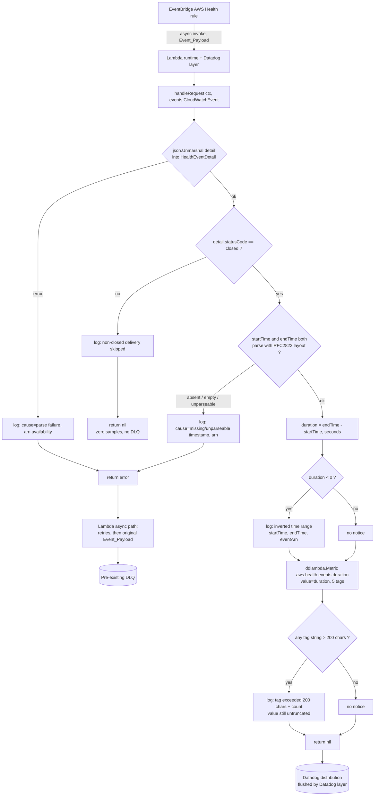

# Design Document

## Overview

The Forwarder already exists as a single-file Go Lambda (`main.go`) wrapped by `ddlambda.WrapFunction`. This design does not build a new function; it narrows the existing one.

After this change the Forwarder does exactly one useful thing: for a Resolved_Event it computes `endTime - startTime` and submits one Datadog distribution sample named `aws.health.events.duration`, tagged with five verbatim fields including the Full_ARN. Everything else the current code emits (`aws.health.issue.received`, `aws.health.issue.alert_status`, `aws.health.issue.duration_seconds`) is deleted, because the Native_Integration already supplies identity, lifecycle, and counts as Datadog Events, and only the duration is impossible to derive in the Datadog query layer (RFC2822 strings, no per-row date parsing, no per-row subtraction).

Two structural changes accompany the narrowing:

1. **Unprocessable payloads become failures instead of silent no-ops.** The current code logs a warning on an unparseable timestamp and skips the metric. The new code returns an error, which routes the Event_Payload to the pre-existing DLQ through the Lambda asynchronous invocation path.
2. **The handler becomes a thin edge over a pure core.** Today all decision logic lives inside `handleRequest`, so the only unit-testable parts are the three tag builders. The new shape is one pure function `evaluate(accountID, detail) (evaluation, error)` that returns *what should be submitted and logged*, plus a handler that performs the two side effects (`ddlambda.Metric`, `log.Printf`) and returns the error. This is what makes the correctness properties in this document testable without a Lambda runtime or a Datadog endpoint.

Statelessness is retained by construction: `evaluate` reads only its arguments, and the process keeps no cross-invocation memory. Deduplication of EventBridge redeliveries stays a query-time concern, handled by the Dedup_Query_Pattern `sum(max:aws.health.events.duration{<scope>} by {arn})`.

Datadog authentication, site, and client configuration come entirely from the Datadog Lambda layer. No code in this repository reads a Datadog API key, site, or endpoint (Requirement 7.5).

### Research Findings

Findings gathered while preparing this design, each of which shaped a decision below:

- **`ddlambda.Metric` cannot report a submission failure.** The v2.9.1 package surface is `func Metric(metric string, value float64, tags ...string)` — no return value. `Distribution(...)` and `MetricWithTimestamp(...)` are likewise void. Samples are buffered by the wrapper and flushed at invocation end. Consequence: there is no error for the Forwarder to observe, so Requirement 4.4 is satisfied structurally (never fail the invocation on submission, never retain the sample) rather than by an error-handling branch. See DR-005 and the Error Handling section.
- **Both direct dependencies are already at their highest stable version inside their existing major.** `go list -m -versions github.com/aws/aws-lambda-go` tops out at `v1.54.0`; `go list -m -versions github.com/DataDog/dd-trace-go/contrib/aws/datadog-lambda-go/v2` has `v2.9.1` as the highest version with no pre-release suffix (`v2.10.0-rc.*` and `v2.11.0-dev` are excluded by Requirement 7.1's stability definition). The dependency task is therefore a re-check plus verification, not a version bump. See the Dependency Design section.
- **The parse layout carries no zone element.** In `Mon, 2 Jan 2006 15:04:05 GMT` the trailing `GMT` is a literal, not Go's `MST` zone token, so `time.Parse` returns instants in UTC. Both endpoints are therefore UTC and their difference is zone-independent (Requirement 1.6). The layout also has whole-second granularity, so `end.Sub(start).Seconds()` is always an integral number of seconds — no rounding is applied or needed (Requirement 1.1).
- **`pgregory.net/rapid` v1.3.0** is the property-based testing library selected for the test suite (see Testing Strategy). It is a test-only dependency and does not enter the Lambda binary.

## Delta From The Current Implementation

Everything below is expressed against the code that exists today.

| Area | Today (`main.go` / `main_test.go`) | After this change |
| --- | --- | --- |
| Metrics emitted | Three: `aws.health.issue.received` (always), `aws.health.issue.alert_status` (always), `aws.health.issue.duration_seconds` (closed only) | One: `aws.health.events.duration`, closed only |
| Tag builders | `receivedMetricTags`, `alertStatusMetricTags`, `durationMetricTags` | One: `metricTags` |
| Tag keys on the duration metric | `receiving_account`, `event_arn`, `aws_service`, `affected_region`, `event_type_code` | `receiving_account`, `arn`, `aws_service`, `affected_region`, `event_type_code` |
| ARN value | Trimmed by `eventArnTagValue` (everything after the second `/`) | Full_ARN verbatim; `eventArnTagValue` deleted |
| `event_scope_code` / `status_code` / `event_type_category` tags | Emitted on `alert_status` / `received` | Not emitted anywhere |
| Non-closed events | Emit two metrics | Log one line, return `nil`, emit nothing |
| Unparseable timestamp on a closed event | `log.Printf("Warning: ...")`, duration silently skipped, invocation succeeds | Typed error returned → DLQ |
| Malformed `detail` JSON | `fmt.Errorf(...)` returned (already fails) | Typed error returned, one log line naming cause `parse failure` and the ARN availability → DLQ |
| Inverted time range | Would emit a negative value implicitly | Emits the negative value **and** logs an explicit inverted-range line with `startTime`, `endTime`, `eventArn` |
| Decision logic location | Inline in `handleRequest` | Pure `evaluate` + helpers; `handleRequest` is an edge shell |
| `HealthEventDetail` fields | 11 fields incl. `eventTypeCategory`, `eventScopeCode`, `communicationId`, `eventDescription` | 7 fields; the four unused ones removed (DR-006) |
| Tests | Three tests asserting the old tag sets — all three must be deleted | Property tests + example tests over the pure core |
| Packaging | None | `.goreleaser.yaml` producing one `dist/*.zip` with `bootstrap` at the archive root |
| Docs | `README.md` contains only the repo name | Full README covering Requirement 8.1–8.9 |
| Dependencies | `datadog-lambda-go/v2 v2.9.1`, `aws-lambda-go v1.54.0`, `go 1.25.3` | Unchanged after re-verification; `go mod tidy` + `go mod verify` clean |

Nothing in this design adds an SQS client, an IAM permission, or any AWS SDK dependency. DLQ delivery is a property of the invocation result, not of code the Forwarder runs (DR-001).

## Architecture

The Forwarder is one Lambda function on the EventBridge asynchronous invocation path. Its only outputs are a buffered Datadog distribution sample, CloudWatch log lines, and an invocation result (success or error) that the Lambda service interprets.



Two points the diagram encodes deliberately:

- Both error branches converge on a single `return error`. The Forwarder never touches the payload bytes on the way to the DLQ.
- The metric-submission edge has no failure branch back into the flow, because the library exposes none (DR-005).

### Layering

| Layer | Contents | Purity |
| --- | --- | --- |
| Edge | `main`, `handleRequest` | Impure: `json.Unmarshal`, `log.Printf`, `ddlambda.Metric`, error return |
| Core | `evaluate`, `metricTags`, `outageDuration`, `oversizedTags` | Pure: arguments in, values out, no I/O, no globals |
| Types | `HealthEventDetail`, `metricSample`, `evaluation`, `notice`, `processingError` | Data only |

All correctness properties target the core. The edge is covered by a small number of example tests plus a fake metric sink.

## Components and Interfaces

### `handleRequest(ctx context.Context, event events.CloudWatchEvent) error`

Unchanged signature, so `ddlambda.WrapFunction(handleRequest, nil)` and `lambda.Start` in `main` are untouched. New body, in order:

1. Log the envelope context (`source`, `detail-type`, `region`) as today.
2. `json.Unmarshal(event.Detail, &detail)`. On error: log one line naming cause `parse failure` and stating whether an ARN is available (it is not, since the unmarshal failed), then return a `*processingError`.
3. Call `evaluate(event.AccountID, detail)`.
4. If `evaluate` returns an error, emit its single log line (cause + ARN or "arn unavailable") and return it. No metric call happens on this path.
5. Otherwise, emit every `notice` in the evaluation as one log line each.
6. If the evaluation carries a sample, call `ddlambda.Metric(sample.Name, sample.Value, sample.Tags...)` and log the submitted value with the ARN.
7. Return `nil`.

The handler contains no arithmetic, no status comparison, and no tag construction. It only sequences side effects.

Note on envelope decoding: `events.CloudWatchEvent` is decoded by the Lambda runtime before `handleRequest` is entered, and `Detail` arrives as `json.RawMessage`. A payload so malformed that the envelope itself fails to decode is rejected by the runtime, which also results in a failed invocation and the same DLQ delivery — the outcome required by Requirement 3.1 holds on both sub-paths, and the Forwarder's own unmarshal covers every payload that reaches it.

### `evaluate(accountID string, detail HealthEventDetail) (evaluation, error)`

The single decision function. Pure, deterministic, total.

```go
type evaluation struct {
    Sample  *metricSample // nil when nothing should be submitted
    Notices []notice      // ordered log intents; may be empty
}
```

Behaviour:

| Input condition | Returns |
| --- | --- |
| `detail.StatusCode != "closed"` (any other value, including `""`, `"open"`, `"Closed"`) | `evaluation{Notices: [nonClosedSkipped]}, nil` |
| `statusCode == "closed"`, both timestamps parse | `evaluation{Sample: &{Name, Value, Tags}, Notices: [...]}, nil` |
| `statusCode == "closed"`, either timestamp absent/empty/unparseable | `evaluation{}, &processingError{Cause: causeBadTimestamp, EventArn: detail.EventArn}` |

Comparison against `"closed"` is an exact byte comparison against the lowercase constant `statusCodeClosed` (already present in `main.go`). No case folding, no trimming (Requirement 1.3).

The notices a successful closed evaluation may carry:

- `noticeInvertedRange` when `Value < 0`, carrying the received `startTime`, the received `endTime`, and the `eventArn` (Requirement 1.5).
- `noticeTagTooLong`, one per tag string longer than 200 characters, carrying the tag key and the character count (Requirement 2.10).

Notices are log intents, not log calls. Keeping them as returned data is what allows a property test to assert "an inverted range always yields exactly one inverted-range notice" without capturing stdout.

### `metricTags(accountID string, detail HealthEventDetail) []string`

Replaces all three current tag builders. Returns exactly five strings in a fixed order:

```go
[]string{
    "receiving_account:" + accountID,
    "arn:" + detail.EventArn,      // Full_ARN, verbatim
    "aws_service:" + detail.Service,
    "affected_region:" + detail.EventRegion,
    "event_type_code:" + detail.EventTypeCode,
}
```

Every value is a raw concatenation. No `strings.TrimSpace`, no `strings.ToLower`, no `url.QueryEscape`, no fallback for an empty value — an absent field yields `key:` with an empty value and the sample is still submitted (Requirements 2.3, 2.6, 2.9). Because the function is a total map over its inputs with no branches, identical `detail` values necessarily produce character-identical tags on every delivery (Requirement 2.7) and in any execution environment (Requirement 4.9).

`eventArnTagValue` is deleted outright, and no replacement shortening helper is introduced (Requirement 2.4). Deletion, rather than leaving the function unused, is what makes "contains no function that truncates the eventArn" checkable by grep.

### `outageDuration(startRaw, endRaw string) (float64, error)`

```go
func outageDuration(startRaw, endRaw string) (float64, error)
```

- Returns `causeBadTimestamp`-flavoured error when `startRaw == ""` or `endRaw == ""`, or when either fails `time.Parse(healthEventTimeFormat, ...)`. An absent JSON field and an explicit `""` are indistinguishable after unmarshal and are treated identically, as Requirement 3.2 requires.
- Otherwise returns `end.Sub(start).Seconds()`, a signed `float64`. Equal timestamps give `0` (Requirement 1.7); an inverted range gives a negative value that is returned unchanged (Requirement 1.5). No clamping, no `math.Abs`, no unit conversion, no default substitution.

The existing `healthEventTimeFormat` constant is reused verbatim.

### `oversizedTags(tags []string) []notice`

Pure helper producing one `noticeTagTooLong` per tag string whose length exceeds 200 characters, recording the key and `len(tag)`. It never modifies the tag (Requirement 2.10). Requirement 2.5 is an obligation on the emitted values rather than on code behaviour: the four non-ARN tags are short by construction, and a Full_ARN long enough to break the limit is logged and still emitted in full.

### `main()`

Unchanged: `lambda.Start(ddlambda.WrapFunction(handleRequest, nil))`. The `nil` config keeps every Datadog setting in the layer's hands (Requirement 7.5).

## Data Models

### `HealthEventDetail` (trimmed)

```go
type HealthEventDetail struct {
    EventArn      string `json:"eventArn"`
    Service       string `json:"service"`
    EventTypeCode string `json:"eventTypeCode"`
    StatusCode    string `json:"statusCode"`
    StartTime     string `json:"startTime"`
    EndTime       string `json:"endTime"`
    EventRegion   string `json:"eventRegion"`
}
```

Four fields are removed: `EventTypeCategory`, `EventScopeCode`, `CommunicationID`, and the `EventDescription` slice. All four are unused once the `received` and `alert_status` metrics are gone. They are removed rather than kept for diagnostics because (a) no specified log line reads them — Requirements 1.5 and 3.3 name only `startTime`, `endTime`, and `eventArn`; (b) the DLQ carries the complete unmodified Event_Payload, so any field is recoverable there for triage; and (c) `event_scope_code` and `status_code` are forbidden tag keys (Requirement 2.4), and a struct field that still exists is the easiest way for them to reappear. See DR-006.

Unmarshalling into this struct ignores unknown JSON fields, which is intentional: AWS Health may add fields, and ignoring them is not a parse failure.

### `metricSample`

```go
type metricSample struct {
    Name  string   // always "aws.health.events.duration"
    Value float64  // Outage_Duration in seconds, signed
    Tags  []string // exactly 5, fixed order
}
```

A value object describing one intended submission. It exists so the pure core can be asserted against without a Datadog client, and so the handler has exactly one place where a submission is performed.

### `notice`

```go
type noticeKind string

const (
    noticeNonClosedSkipped noticeKind = "non_closed_skipped"
    noticeInvertedRange    noticeKind = "inverted_time_range"
    noticeTagTooLong       noticeKind = "tag_exceeds_200_chars"
)

type notice struct {
    Kind   noticeKind
    Fields map[string]string // e.g. startTime, endTime, eventArn, tagKey, length
}
```

### `processingError`

```go
type failureCause string

const (
    causeParseFailure failureCause = "parse failure"
    causeBadTimestamp failureCause = "missing/unparseable timestamp"
)

type processingError struct {
    Cause    failureCause
    EventArn string // "" when unavailable
    Err      error  // wrapped json/time error, may be nil
}

func (e *processingError) Error() string { /* includes Cause and arn or "arn unavailable" */ }
func (e *processingError) Unwrap() error { return e.Err }
```

The two constants are the only two failure causes the Forwarder may name (Requirement 3.3). Making the cause a typed field, not a formatted string, lets a property test assert the named cause for every generated bad input.

### Emitted Metric Contract

| Aspect | Value |
| --- | --- |
| Name | `aws.health.events.duration` |
| Type | Datadog distribution (via `ddlambda.Metric`) |
| Value | Outage_Duration in seconds, signed, whole seconds |
| Emitted when | `detail.statusCode == "closed"` and both timestamps parse |
| Tags | `receiving_account`, `arn`, `aws_service`, `affected_region`, `event_type_code` |

| Tag key | Source field |
| --- | --- |
| `receiving_account` | EventBridge envelope `account` (`event.AccountID`) |
| `arn` | `detail.eventArn`, untrimmed |
| `aws_service` | `detail.service` |
| `affected_region` | `detail.eventRegion` |
| `event_type_code` | `detail.eventTypeCode` |

## Correctness Properties

*A property is a characteristic or behavior that should hold true across all valid executions of a system — essentially, a formal statement about what the system should do. Properties serve as the bridge between human-readable specifications and machine-verifiable correctness guarantees.*

These properties are testable with property-based testing because the decision core (`evaluate`, `metricTags`, `outageDuration`, `oversizedTags`) is a set of pure functions over a large input space: arbitrary ARNs, arbitrary status strings, arbitrary timestamp strings, and arbitrary instant pairs. The infrastructure-facing criteria (GoReleaser packaging, dependency versions, documentation content, DLQ delivery by the Lambda service) are covered by build checks, source checks, and review, not by properties — see Testing Strategy.

### Property 1: Closed events with parseable timestamps yield exactly one correctly valued sample

*For any* EventBridge account id, *any* Health_Event_Detail whose `statusCode` is exactly `closed`, and *any* pair of UTC instants at whole-second granularity rendered with the AWS Health RFC2822 layout as `startTime` and `endTime` (including equal instants and instants with empty values in the other four source fields), evaluation returns no error and exactly one metric sample whose name is `aws.health.events.duration` and whose value equals the signed number of seconds of `endTime` minus `startTime`, with no rounding, clamping, unit conversion, or default substitution.

**Validates: Requirements 1.1, 1.7, 2.9, 3.5**

### Property 2: The tag set is exactly five verbatim key:value pairs carrying the Full_ARN under `arn`

*For any* account id and *any* Health_Event_Detail, including empty, whitespace-only, mixed-case, unicode, and over-long field values, the tags built for a sample are exactly five strings, one per key in the set `{receiving_account, arn, aws_service, affected_region, event_type_code}` with no key repeated and no sixth key; each tag equals its key followed by `:` followed by the corresponding source value copied byte-for-byte with no truncation, splitting, case change, whitespace trimming, or encoding; the ARN value appears under the `arn` key and under no other key; and no tag key is `event_arn`, `event_scope_code`, `status_code`, or `event_type_category`.

**Validates: Requirements 2.1, 2.2, 2.3, 2.4, 2.6, 2.8, 2.9**

### Property 3: The AWS Health time layout round-trips UTC instants

*For any* UTC instant truncated to whole seconds, formatting it with the layout `Mon, 2 Jan 2006 15:04:05 GMT` and parsing the result with the same layout returns an instant equal to the original, and the parsed value carries no non-UTC zone offset.

**Validates: Requirements 1.6**

### Property 4: An inverted time range emits the negative value and reports it

*For any* pair of UTC instants where the end instant precedes the start instant, evaluation of a closed event carrying them returns no error, a sample whose value is the unchanged negative second delta, and exactly one inverted-time-range notice carrying the received `startTime` value, the received `endTime` value, and the `eventArn` value.

**Validates: Requirements 1.5**

### Property 5: A closed event with an absent, empty, or unparseable timestamp always fails with the timestamp cause

*For any* Health_Event_Detail whose `statusCode` is exactly `closed` and whose `startTime` or `endTime` is absent, is the empty string, or is any string rejected by the layout `Mon, 2 Jan 2006 15:04:05 GMT`, evaluation returns no metric sample and returns an error whose named cause is `missing/unparseable timestamp` and whose ARN field equals the received `detail.eventArn`.

**Validates: Requirements 3.2, 3.3**

### Property 6: An unmarshalable detail payload always fails with the parse cause and submits nothing

*For any* byte sequence that `encoding/json` cannot unmarshal into a Health_Event_Detail, handling that payload records zero metric submissions on the submission sink and returns an error whose named cause is `parse failure`, recording that the ARN is unavailable.

**Validates: Requirements 3.1, 3.3**

### Property 7: A non-closed status never errors and never emits

*For any* Health_Event_Detail whose `statusCode` is any string other than the exact lowercase `closed` — including the empty string, `open`, `upcoming`, `Closed`, `CLOSED`, and arbitrary unicode — and *any* `startTime` and `endTime` values whatsoever, including absent, empty, and unparseable ones, evaluation returns no error and no metric sample.

**Validates: Requirements 1.3, 3.6**

### Property 8: Evaluation is a pure function of the single payload

*For any* sequence of Event_Payloads in *any* order, with *any* duplicates and interleavings, and for *any* number of repeated evaluations within one process, the outcome produced for a given payload — the metric name, the metric value with no numeric difference, the five tag strings character-for-character, the notices, and the named failure cause when the payload fails — is identical to the outcome produced when that payload is evaluated in isolation as the first payload of a fresh process.

**Validates: Requirements 2.7, 3.7, 4.1, 4.3, 4.9, 7.7**

### Property 9: An over-limit ARN tag is emitted untruncated and reported

*For any* `eventArn` value, the emitted `arn` tag value equals the input with no shortening, and a tag-length notice recording the tag key and its character count is produced exactly when the assembled tag string `arn:<eventArn>` exceeds 200 characters.

**Validates: Requirements 2.5, 2.10**

## Error Handling

The Forwarder has exactly two failure causes, both surfaced as `*processingError` and both resulting in a returned error from `handleRequest`.

### DLQ Decision Table

| Condition | Metric samples | Handler result | Payload to DLQ | Log |
| --- | --- | --- | --- | --- |
| `detail` cannot be unmarshalled | 0 | error, cause `parse failure` | Yes | 1 line: cause + "arn unavailable" |
| `statusCode == closed`, `startTime` or `endTime` absent | 0 | error, cause `missing/unparseable timestamp` | Yes | 1 line: cause + `eventArn` (or ARN-unavailable note) |
| `statusCode == closed`, timestamp is `""` | 0 | error, cause `missing/unparseable timestamp` | Yes | 1 line as above |
| `statusCode == closed`, timestamp rejected by the layout | 0 | error, cause `missing/unparseable timestamp` | Yes | 1 line as above |
| `statusCode == closed`, both parse, `end > start` | 1 | `nil` | No | submission line |
| `statusCode == closed`, both parse, `end == start` | 1 (value 0) | `nil` | No | submission line |
| `statusCode == closed`, both parse, `end < start` | 1 (negative value) | `nil` | No | inverted-range line + submission line |
| `statusCode != closed` (any value, incl. empty), any timestamps | 0 | `nil` | No | non-closed skip line |
| `arn` tag string longer than 200 characters | 1, ARN untruncated | `nil` | No | tag-length line + submission line |
| Datadog never receives the submitted sample | 1 attempted | `nil` | No | submission line (see below) |

### How Returning An Error Preserves The Payload Byte-For-Byte

EventBridge invokes the Lambda asynchronously. On an asynchronous invocation the Lambda service accepts the Event_Payload, stores it in its internal queue, and hands a copy to the function. When the handler returns an error, the service retries the invocation according to the function's async configuration and, once attempts are exhausted, delivers **the payload it holds** to the configured dead-letter target. The payload it holds is the payload EventBridge sent — the function never participates in that delivery.

This is why the design routes to the DLQ by returning an error instead of calling SQS (DR-001). Requirement 3.4 asks that the payload reach the DLQ byte-for-byte identical and replayable without editing. An explicit `sqs:SendMessage` would have to reconstruct a message body from the decoded `events.CloudWatchEvent`, which re-marshals JSON: key order, number formatting, unicode escaping, and whitespace would all be at the mercy of Go's encoder, and any field absent from `HealthEventDetail` would be dropped entirely. Returning an error removes that risk category rather than mitigating it: there is no code path in the Forwarder that can serialize, edit, or forward the payload, so byte-for-byte identity is structural. It also means no SQS client, no queue URL configuration, and no additional IAM permission on the execution role.

One consequence to accept: async retries mean a failing payload is processed more than once before it lands in the DLQ. Because the handler is a pure function of the payload, every attempt reaches the same cause and emits zero samples (Property 8, Requirement 3.7), so retries are harmless.

### Metric Submission Failure (Requirement 4.4)

`ddlambda.Metric` has signature `func Metric(metric string, value float64, tags ...string)`. It returns nothing. Samples are buffered by the wrapper installed by `ddlambda.WrapFunction` and flushed to Datadog at the end of the invocation, outside the handler's control. There is no error value, no callback, and no status the Forwarder can inspect.

The design therefore does not invent an error path. Requirement 4.4's obligations are met as follows:

- *Complete the invocation successfully*: the handler returns `nil` after the submission call unconditionally. Satisfied.
- *Make no further submission attempt*: exactly one `ddlambda.Metric` call per invocation, in one place. Satisfied and asserted by the fake-sink handler test.
- *Retain no record of the unsubmitted sample*: no package-level mutable state exists; the sample value object is a local. Satisfied.
- *Do not route to the DLQ*: no error is returned on this path. Satisfied.
- *Write a log entry recording the failed submission including the eventArn*: **not achievable for library-internal failures**, because the failure is not observable to our code. Instead the Forwarder logs one line per attempted submission containing the `eventArn`, the metric name, and the value, so a sample that Datadog never ingests is still reconstructible from CloudWatch Logs, and the Datadog layer writes its own transport errors to the same log group. This limitation is recorded in the README (DR-005) rather than papered over with a branch that can never execute.

### Logging Contract

One log line per event, each a single `log.Printf`:

| Situation | Content |
| --- | --- |
| Invocation start | `source`, `detail-type`, `region` |
| Parse failure | cause `parse failure`, `arn unavailable` |
| Bad timestamp | cause `missing/unparseable timestamp`, `eventArn` or ARN-unavailable note, the received `startTime` and `endTime` |
| Non-closed delivery | `statusCode`, `eventArn` |
| Inverted range | `startTime`, `endTime`, `eventArn` |
| Tag over 200 chars | tag key, character count |
| Submission attempted | metric name, value, `eventArn` |

## Testing Strategy

`main_test.go` as it exists today asserts the removed tag sets (`event_arn:`, `event_scope_code:`, `status_code:`, `event_type_category:`) and calls two functions that cease to exist. All three tests — `TestAlertStatusMetricTagsAreStableAcrossLifecycleUpdates`, `TestReceivedMetricTagsIncludeDeliveryContextWithoutUnboundedIDs`, `TestDurationMetricTagsAreLowCardinality` — are deleted and replaced.

### Property-Based Tests

- Library: `pgregory.net/rapid` v1.3.0, a test-only dependency. Property-based testing is not implemented from scratch.
- One property test function per property in this document. Nine property tests total.
- Each configured for a minimum of 100 iterations (rapid's default check count exceeds this; the count is set explicitly so the floor is visible in the source).
- Each tagged with a comment in the form:
  `// Feature: aws-health-event-telemetry, Property 2: The tag set is exactly five verbatim key:value pairs carrying the Full_ARN under arn`

Generators to build:

| Generator | Coverage obligations |
| --- | --- |
| `genFieldValue` | empty string, whitespace-only, mixed case, unicode, 250+ character strings |
| `genEventArn` | realistic AWS Health ARNs, ARNs with zero/one/many `/`, ARNs pushing `arn:<value>` below, at, and above 200 characters |
| `genStatusCode` | `closed` (for closed paths) and, for Property 7, arbitrary strings filtered to exclude exactly `closed`, seeded with `""`, `open`, `upcoming`, `Closed`, `CLOSED`, ` closed` |
| `genInstantPair` | ordered, equal, and inverted pairs; multi-day gaps; year boundaries; all truncated to whole seconds and formatted with the layout |
| `genBadTimestamp` | `""`, ISO-8601 strings, RFC3339 strings, layout with a missing component, non-date noise, valid-shaped but invalid dates |
| `genMalformedDetail` | truncated JSON, JSON arrays, JSON scalars, wrong types for string fields, empty bytes, non-UTF-8 bytes |

Properties 1, 2, 3, 4, 5, 7, 8, 9 exercise the pure core directly. Property 6 runs through `handleRequest` with an injected fake submission sink so it can assert zero submissions.

### Submission Sink Seam

To assert submission counts without a Datadog endpoint, the single `ddlambda.Metric` call site is reached through a package-level function value:

```go
var submitMetric = ddlambda.Metric // replaced in tests with a recording fake
```

This is the only package-level variable, it is never mutated in production code, and it holds no per-invocation data, so Requirement 4.2 is preserved. Tests swap it and restore it with `t.Cleanup`.

### Example And Edge-Case Tests

| Test | Covers |
| --- | --- |
| Distribution submission shape: one submission per closed event, via the fake sink | 1.2 |
| Metric-name hygiene: scan `*.go` for `aws.health.issue.received`, `aws.health.issue.alert_status`, `aws.health.issue.duration_seconds` — all absent | 1.4 |
| Source hygiene: `eventArnTagValue` absent from `*.go` | 2.4 |
| Datadog config hygiene: no `DD_API_KEY`, `DD_SITE`, site, or metrics-endpoint value or read in `*.go` | 7.5 |
| No SQS/AWS SDK client and no payload re-marshalling in `*.go` | 3.4, DR-001 |
| Single-log-line assertions for both failure causes, with captured log output | 3.3 |
| Equal-timestamp example: value exactly `0`, nil error | 1.7 |
| Best-effort submission example: exactly one submission call, nil error, log line carries the `eventArn` and value | 4.4 |

Unit tests stay deliberately few. Broad input coverage is the property tests' job; these examples pin the specific facts and repository-hygiene rules that properties cannot express.

### Build, Packaging, And Dependency Checks

Not unit tests; run once per change during implementation.

| Check | Command | Covers |
| --- | --- | --- |
| Compile | `go build ./...` exits 0 | 7.3 |
| Test suite | `go test ./...` exits 0, no skips | 7.3 |
| Module integrity | `go mod verify` exits 0; `go mod tidy` leaves `go.mod`/`go.sum` unchanged | 7.4 |
| Highest stable versions | `go list -m -versions` for both direct modules, compared against `go.mod` | 7.1, 7.2, 7.6 |
| GoReleaser config validity | `goreleaser check` exits 0 | 6.5 |
| Artifact shape | snapshot build, then list archive entries: exactly one `bootstrap` at the root with the owner-execute bit and no other executable entry; exactly one zip in `dist/` | 6.2, 6.3, 6.4 |
| Build determinism | run the snapshot build twice, diff the entry listings (names, paths, modes) | 6.6 |

### Documentation Review Checklist

Requirements 4.5–4.8, 5.1–5.7, 6.7, and 8.1–8.9 are content obligations on `README.md`. They are verified by a review checklist with one item per criterion at implementation completion, not by executable tests.

## Packaging And Build Design

New file: `.goreleaser.yaml` at the repository root. Shape:

- `builds`: a single build entry, `goos: [linux]`, `goarch: [amd64]`, `binary: bootstrap`, `main: .`, `env: [CGO_ENABLED=0]`, `ldflags: [-s -w]`. One target only, so exactly one archive is produced (Requirements 6.2, 6.3).
- `archives`: a single archive entry with `formats: [zip]`, no wrapping directory (`wrap_in_directory: false`) so `bootstrap` sits at the archive root, and no extra `files` entries so the archive holds nothing but the binary (Requirement 6.3). A stable `name_template` keeps the artifact path predictable for the README.
- `dist`: default `dist/`, giving `dist/<name>.zip` as the Release_Bundle (Requirement 6.4).
- `changelog`: disabled — irrelevant to a Lambda artifact and a source of noise in snapshot builds.

The execute bit: GoReleaser writes compiled binaries with mode `0755` and preserves that mode in zip entries, so `bootstrap` carries owner-execute without an explicit setting. The artifact-shape check above asserts it rather than assuming it.

Determinism (Requirement 6.6): with a single target, a fixed binary name, no wrapping directory, and no extra files, two builds from the same commit produce identical entry names, paths, and modes. Only the compressed bytes and timestamps may differ, which the requirement does not constrain.

`provided.al2` / `provided.al2023` compatibility comes from the `bootstrap` entry-point name; no runtime shim is needed because `aws-lambda-go`'s `lambda.Start` speaks the custom runtime API.

The command documented in the README is the snapshot form (`goreleaser release --snapshot --clean`), because the repository has no tag-driven release process in scope; it produces the same `dist/` artifact.

## Dependency Design

Requirement 7 asks for the highest stable version within each existing major. Checked against the module proxy while preparing this design:

| Module | Declared | Highest stable in major | Action |
| --- | --- | --- | --- |
| `github.com/DataDog/dd-trace-go/contrib/aws/datadog-lambda-go/v2` | `v2.9.1` | `v2.9.1` (`v2.10.0-rc.*`, `v2.11.0-dev` excluded as pre-release) | Keep; re-check at implementation time |
| `github.com/aws/aws-lambda-go` | `v1.54.0` | `v1.54.0` | Keep; re-check at implementation time |
| `go` directive | `1.25.3` | — | Keep (meets the 7.2 floor) |

So the dependency work is verification, not a bump: re-run `go list -m -versions` at implementation time, raise only if a new stable version has appeared, then `go mod tidy`, `go mod verify`, `go build ./...`, `go test ./...`. Requirement 7.6's documentation obligation is vacuous unless a re-check surfaces a newer stable version that fails the build or tests; only then does the README record the retained version and the reason.

Adding `pgregory.net/rapid` introduces a test-only module into the build list; `go mod tidy` places it in `go.mod` and its checksums in `go.sum`, keeping Requirement 7.4 satisfied. It is not linked into the Lambda binary.

## Documentation Design

`README.md` is a deliverable, currently a single heading. Section plan, each section mapping to Requirement 8 criteria (and to the documentation criteria in Requirements 4, 5, and 6):

| Section | Content | Covers |
| --- | --- | --- |
| Purpose | What the Forwarder is, EventBridge AWS Health event as the only input, `aws.health.events.duration` as the only output, Outage_Duration in seconds as the value the Native_Integration cannot supply | 8.1 |
| Metric reference | Name, distribution type, value semantics, the five tag keys each paired with its source field | 8.2 |
| Why this exists: the duplicate-delivery defect | EventBridge redelivery inflating sums (observed `multiple_services` total of 10,325 seconds), why no query-only fix was possible (no per-outage identity tag, stateless function), `eventArn` stable vs `communicationId` changing per delivery | 8.3 |
| Query patterns | Dedup_Query_Pattern `sum(max:aws.health.events.duration{<scope>} by {arn})` with the inner-max / outer-sum explanation; table widget rows `arn` and column aggregation `max` not `sum`; `arn` cardinality bound of one value per distinct `eventArn`, no reduction applied, cost accepted | 4.5, 4.6, 4.7 |
| Delivery semantics | Best-effort submission, a lost sample is permanently lost with no retry, no reconciliation, no DLQ routing; duplicates expected and resolved at query time; the `ddlambda.Metric` no-error constraint | 4.8, DR-005 |
| Native integration boundary | Identity, lifecycle, and counts from Native_Integration events only; why the Native_Integration cannot compute a duration (RFC2822 strings; no per-row date parsing or subtraction in the query layer); already enabled in `aws_is0001_prod` and out of scope; per-source account filtering via `receiving_account` vs the account id on native events; Full_ARN byte-for-byte join and the zero-series consequence of a transformed ARN; `aws_service` byte-for-byte match and the zero-series consequence of a mismatch; the one-source-per-property table; count comparisons require the dedup pattern | 5.1–5.7 |
| Non-closed behaviour | A non-`closed` `statusCode` yields a successful invocation with zero samples, so missing samples are not a failure signal | 8.7 |
| Dead letter queue | Both conditions (unmarshalable payload; closed event with missing or unparseable timestamps), the complete unmodified payload preserved, zero samples for that invocation, and that routing happens by returning an error on the async path | 8.4 |
| Build, test, release | `go build ./...`, `go test ./...`, `goreleaser release --snapshot --clean`; artifact written to `dist/`; `bootstrap` entry-point name inside the archive | 6.7, 8.5 |
| Metric type rationale | Distributions because the Datadog Lambda library submits distributions; gauge or count would require DogStatsD on `127.0.0.1:8125` or the Datadog HTTP API | 8.6 |
| Migration notes | Removed metric names `aws.health.issue.received`, `aws.health.issue.alert_status`, `aws.health.issue.duration_seconds`; `event_arn` tag key replaced by `arn` | 8.8 |

The file exists as `README.md` with one section per topic (Requirement 8.9).

## Design Decision Records

### DR-001: Route to the DLQ by returning an error, not by calling SQS

**Decision.** The handler returns an error; the Lambda asynchronous invocation path delivers the payload to the pre-existing DLQ. No SQS client, no queue URL, no IAM change.

**Alternative considered.** An explicit `sqs:SendMessage` from the handler, then returning `nil`.

**Why rejected.** Requirement 3.4 requires the DLQ payload to be byte-for-byte identical to what was received. An explicit send would have to rebuild the message body from the already-decoded `events.CloudWatchEvent`, re-marshalling JSON and dropping every field not present in `HealthEventDetail`. It would also add an SDK dependency, an execution-role permission, a queue URL configuration surface, and a new failure mode (what happens when the send fails?). Returning an error eliminates the whole category — the Forwarder cannot mutate what it never touches. Accepted cost: async retries process the failing payload more than once before it is dead-lettered, which is harmless because the handler is pure.

### DR-002: DLQ on unparseable timestamps, not only on missing ones

**Decision.** For a closed event, an absent, empty, or format-rejected `startTime`/`endTime` all produce the same failure.

**Alternative considered.** Keep the current behaviour for unparseable values — log a warning, skip the metric, succeed — and dead-letter only truly missing fields.

**Why rejected.** The current silent skip is how outages disappear without a trace: the invocation reports success, no sample exists, and nothing distinguishes it from a non-closed delivery. An unparseable timestamp means the payload contained a duration we were supposed to measure and could not, which is exactly the case an operator needs to see and replay. Collapsing all three shapes into one cause also keeps Requirement 3.3's two-value cause vocabulary intact and makes Property 5 a single statement instead of a case split. Accepted cost: an AWS-side format change would fill the DLQ rather than quietly dropping samples — the louder failure is the intended one.

### DR-003: Emit a negative duration rather than dead-lettering an inverted range

**Decision.** When `endTime < startTime`, submit the negative value unchanged and log an inverted-range line. Invocation succeeds.

**Alternatives considered.** Dead-letter the payload; clamp to zero; take the absolute value.

**Why rejected.** Requirement 1.5 mandates the unchanged value, and the reasoning holds up: both timestamps parsed, so the payload is not unprocessable — it is upstream data that contradicts itself. Clamping or absolving would silently fabricate a duration and make the defect invisible in Datadog. A negative sample is self-evident in a dashboard and is traceable to a log line carrying both received timestamps and the ARN. Dead-lettering would discard a parseable event and hide an upstream data-quality problem in a queue nobody watches.

### DR-004: Build only linux/amd64

**Decision.** A single GoReleaser target: `linux/amd64`.

**Alternative considered.** Also building `linux/arm64` for Graviton.

**Why rejected.** Requirement 6.2 names amd64 as the only target, and Requirement 6.4 requires exactly one zip in `dist/` — a second target would produce a second archive and fail that check. The Lambda function resource is out of scope for this spec, so its architecture cannot be changed here anyway. Adding arm64 later is a two-line change plus a rethink of the one-archive rule.

### DR-005: Distribution via `ddlambda.Metric`, and no invented submission-error path

**Decision.** Submit through `ddlambda.Metric`, which always produces a distribution. Do not add a branch that handles a submission error.

**Rationale.** The v2.9.1 API surface is `func Metric(metric string, value float64, tags ...string)` — void. `Distribution` and `MetricWithTimestamp` are void as well. Samples are buffered by the wrapper and flushed by the Datadog layer after the handler returns, so a transport failure happens outside the handler's lifetime and is never reported to it. Writing `if err := ...` is impossible; simulating one would be dishonest test scaffolding.

Consequence for Requirement 4.4: the invocation-level obligations (succeed, one attempt, retain nothing, no DLQ) are satisfied structurally and asserted with a fake sink. The "log the failed submission" obligation is met as far as the library allows — one log line per attempted submission, carrying the `eventArn`, metric name, and value, so an unsubmitted sample remains reconstructible from CloudWatch Logs while the Datadog layer logs its own transport errors to the same log group. The gap is documented in the README rather than hidden.

Gauge or count submission would require either DogStatsD on `127.0.0.1:8125` (which means adding the Datadog extension layer and a StatsD client) or direct Datadog HTTP API calls (which means handling an API key in code, forbidden by Requirement 7.5). Distribution also happens to be the right type: it preserves every sample within a rollup window, which is what makes the query-time `max ... by {arn}` dedup work.

### DR-006: Remove the four now-unused `HealthEventDetail` fields

**Decision.** Delete `EventTypeCategory`, `EventScopeCode`, `CommunicationID`, and `EventDescription` from the struct.

**Alternative considered.** Keep them for logging and DLQ triage.

**Why rejected.** No specified behaviour reads them: the log lines in Requirements 1.5 and 3.3 name only `startTime`, `endTime`, and `eventArn`, and Requirement 2.4 forbids `event_scope_code` and `status_code` as tag keys. Every field remains recoverable from the DLQ, which holds the complete unmodified payload, so triage loses nothing. Keeping fields that exist only as decoration is the cheapest way for a forbidden tag to reappear in a later change. Unknown JSON fields are ignored on unmarshal, so removing them cannot turn a valid payload into a parse failure.

### DR-007: Extract a pure `evaluate` core and return log intents as data

**Decision.** Move all decision logic out of `handleRequest` into pure functions, and have `evaluate` return `notice` values that the handler turns into log lines.

**Rationale.** The current design only allows the tag builders to be tested; the duration arithmetic, the status gate, and the skip behaviour are unreachable without invoking Lambda. Requirements 1.5 and 2.10 make specific log entries part of the contract, and asserting log output through captured stdout is brittle and awkward to express as a property. Returning notices as data makes those obligations first-class assertions (Properties 4 and 9) while keeping every `log.Printf` at the edge. Cost: one extra type and a slightly longer handler. It buys the entire property suite.
